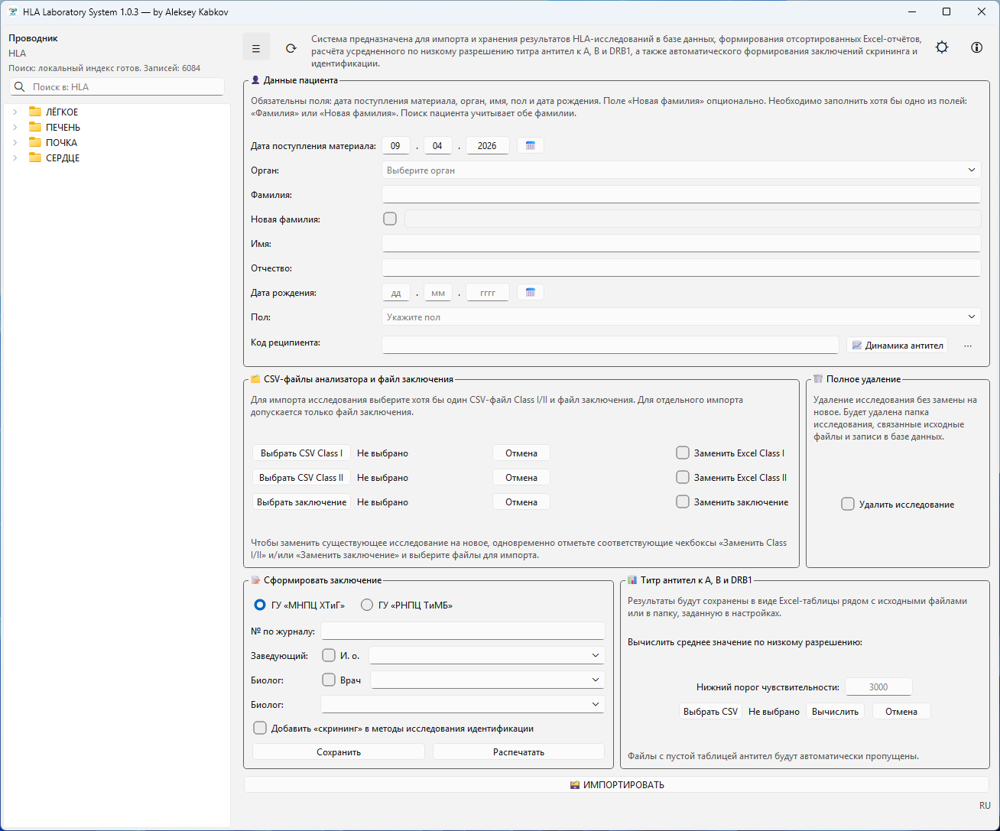
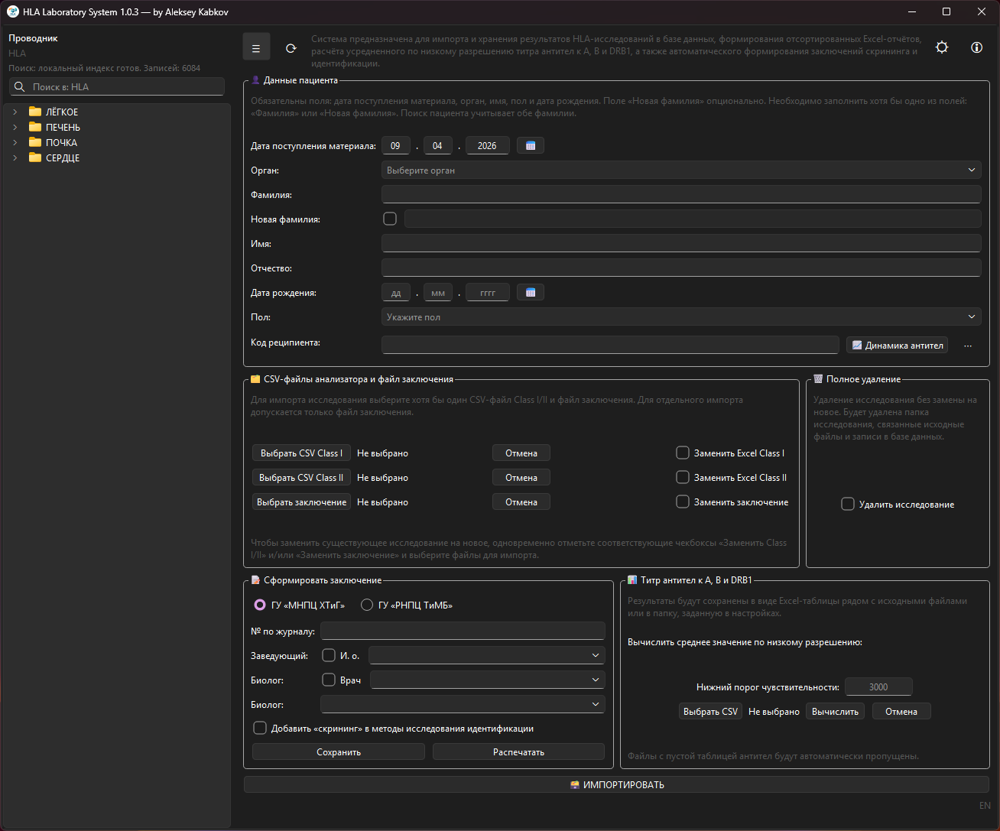
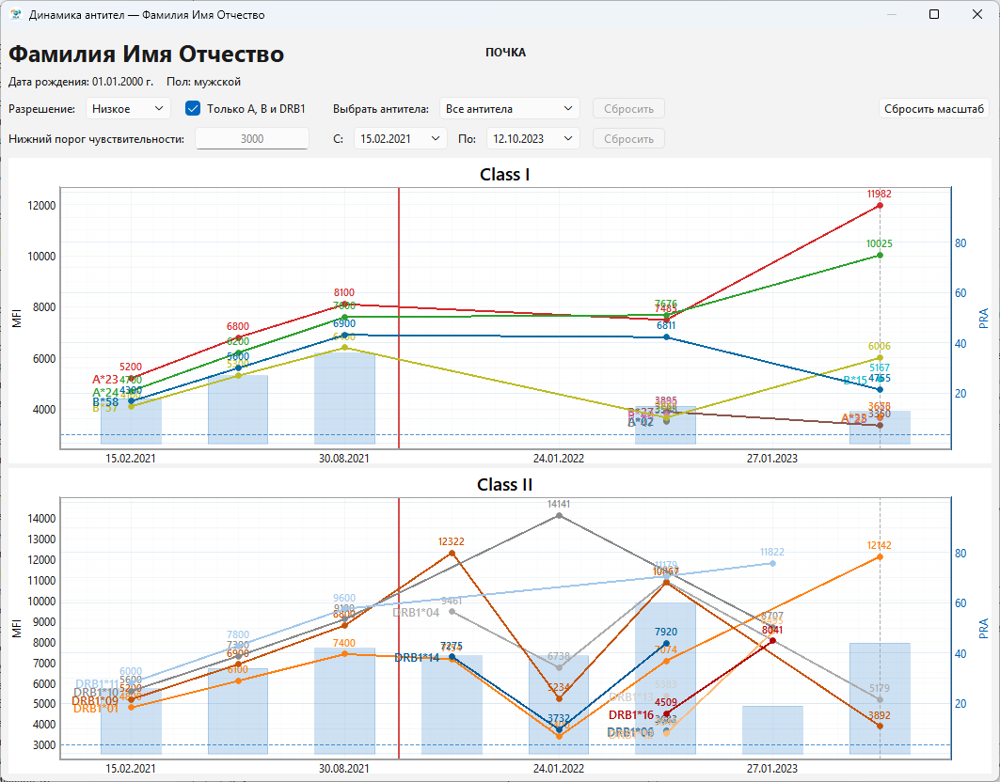
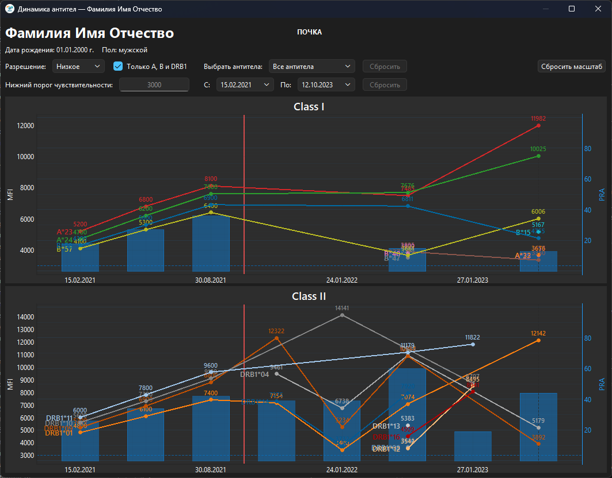

# HLA Laboratory System

Версия: **1.0.3**

## Интерфейс приложения

<p align="center">
  
  
</p>
<p align="center">
  
  
</p>

**HLA Laboratory System** — настольное приложение для лаборатории HLA-диагностики. Система автоматизирует импорт результатов с анализатора, ведение файловой базы пациентов, поиск по архиву исследований и подготовку выходных документов для практической работы врачей.

Приложение может использоваться в HLA-лабораториях различного профиля,
если их рабочие процессы совместимы с поддерживаемой файловой и исследовательской моделью.
При этом проект преимущественно ориентирован на задачи трансплантологии
и ведение пациентов после трансплантации органов.

Проект ориентирован на внутреннее использование в лаборатории и построен вокруг двух источников данных:

- **файловая база** на локальном или сетевом диске, где хранятся все исходные результаты и связанные документы;
- **PostgreSQL**, где сохраняются только положительные и исследовательски значимые результаты.

Для аналитического сценария `📈 Динамика антител` приложение также может
подключать **дополнительную PostgreSQL** с той же схемой таблиц. Эта база
используется только в режиме чтения для построения общей хронологии
исследований и не заменяет основную рабочую БД приложения.

## Назначение и функции


Приложение объединяет несколько рабочих задач в одном интерфейсе:

- импортирует CSV-файлы, выгруженные с лабораторного анализатора HLA;
- импортирует файл заключения в формате JPEG (`.jpg`, `.jpeg`) или Word (`.doc`, `.docx`);
- при выборе Word-документа заключения автоматически преобразует его в PDF для сохранения в файловой базе;
- создает и поддерживает структуру файловой базы по органам, пациентам и датам исследований;
- сохраняет все исходные CSV и сформированные Excel-файлы, включая отрицательные результаты;
- записывает в PostgreSQL только положительные результаты с непустой таблицей антител;
- позволяет искать пациентов, исследования и файлы через боковой проводник и локальный индекс;
- строит интерактивную динамику антител по основной PostgreSQL и, при наличии, по дополнительной базе данных только для чтения с общей временной шкалой исследований;
- формирует отчёты Excel и заключения DOCX;
- помогает постепенно переводить папки пациентов к новому формату именования;
- запускается в ограниченном режиме, если файловая база или PostgreSQL временно недоступны; при недоступной файловой базе главное окно открывается, но импорт и боковой проводник временно недоступны, а при недоступном PostgreSQL блокируются импорт исследований и окно динамики антител.

## Основные возможности

### 1. Импорт результатов HLA-анализа

Приложение работает с CSV фиксированной структуры, полученными с анализатора:

- Class I Single Antigen Results;
- Class II Single Antigen Results.

Во время импорта приложение:

- считывает данные пациента, дату исследования, PRA и таблицу антител;
- определяет класс исследования;
- связывает исследование с органом;
- принимает файл заключения в формате JPEG (`.jpg`, `.jpeg`) или Word (`.doc`, `.docx`);
- при импорте Word-документа сохраняет итоговый файл заключения в формате PDF (`.pdf`);
- сохраняет исходный CSV в файловую базу;
- формирует Excel-файл для ежедневной работы;
- создает или использует существующую папку пациента;
- синхронизирует положительные результаты с PostgreSQL.

### 2. Разделение файловой и исследовательской модели данных

Это одно из ключевых архитектурных решений проекта.

**Файловая база** хранит:

- все исходные CSV;
- все сформированные Excel-файлы;
- отрицательные и положительные результаты;
- сопутствующие изображения и документы пациента;
- исторические данные в старом и новом формате именования папок.

**PostgreSQL** хранит:

- только положительные результаты;
- только исследования, где есть реальные строки антител;
- нормализованные данные для последующего научного анализа.

Если положительный результат был исправлен на отрицательный и у пациента больше не осталось ни одного положительного исследования, запись пациента удаляется из PostgreSQL как осиротевшая, но файловая база при этом сохраняет полный архив документов.

### 3. Файловый менеджер и поиск

В боковой панели доступен встроенный проводник, который умеет:

- показывать файловую базу по органам, пациентам и исследованиям;
- искать по имени файла или папки;
- использовать локальный SQLite-индекс для быстрого поиска;
- автоматически переключаться на резервный режим поиска по дереву, если индекс недоступен;
- открывать найденные объекты прямо в дереве;
- сортировать папки исследований по реальной дате `dd.mm.yyyy`;
- выполнять переименование прямо в списке там, где это допустимо;
- защищать управляемые служебные файлы и папки от опасных операций.

### 4. Работа с папками пациентов

Проект поддерживает как исторические, так и новые форматы именования папок пациентов.

Примеры:

- старый формат: `Иванов_А.А`
- новый формат: `Иванов_Алексей.Андреевич_01.01.1980_м`
- с новой фамилией: `Иванова(Петрова)_Мария_12.03.1992_ж`
- с двойной фамилией: `Сидоров-Петров_Андрей.Сергеевич_07.05.1988_м`

Приложение умеет:

- подбирать существующую папку пациента;
- создавать новую;
- переименовывать старые папки в новый формат;
- обновлять связанные служебные файлы в `source_files`;
- откатывать изменения при ошибке операции.

### 5. Формирование документов

Приложение содержит отдельные сценарии генерации документов:

- Excel с результатами сортировки антител;
- Excel для блока суммарного титра антител к `A`, `B`, `DRB1`;
- DOCX-заключения для клинической работы.

Настройки путей сохранения можно хранить в пользовательских настройках приложения.

### 6. Динамика антител

Отдельное окно `📈 Динамика антител` предназначено для просмотра
исследовательской истории пациента по основной PostgreSQL и, при необходимости,
по дополнительной PostgreSQL с той же схемой таблиц.

Окно позволяет:

- открывать пациента по `recipient_code` и органу или по персональным данным в пределах выбранного органа;
- отображать сведения о пациенте только по основной БД приложения;
- строить синхронные графики `Class I` и `Class II` на общей временной оси;
- переключать детализацию между сериями низкого и высокого разрешения;
- ограничивать отображение только антителами к `A`, `B`, `DRB1`;
- менять нижний порог чувствительности без повторной загрузки данных из БД;
- использовать дополнительную БД только для чтения как источник более ранних или более поздних исследований;
- показывать визуальную границу между основной и дополнительной БД, если обе дали данные пациента.

По бизнес-логике этого сценария:

- **основная PostgreSQL** остаётся единственным обязательным источником и
  единственной БД, в которую приложение записывает данные;
- **дополнительная PostgreSQL** используется только для чтения и только внутри
  окна динамики антител;
- при недоступной дополнительной БД окно динамики всё равно должно работать по
  основной БД;
- общая временная ось и красная вертикальная граница между БД рассчитаны на
  хронологически разделённые источники: как штатный сценарий предполагается,
  что одна лаборатория даёт более ранний участок истории пациента, а другая —
  более поздний;
- по умолчанию для дополнительной БД используется имя базы противоположной
  клиники, но пользователь может переопределить его во всплывающем окне `⋯`
  рядом с кнопкой `📈 Динамика антител`.

### 7. Устойчивость и защита данных

Для рабочих сценариев лаборатории в проекте важна не только функциональность, но и отказоустойчивость. Поэтому в приложении реализованы:

- проверка доступности файловой базы и PostgreSQL на старте;
- запуск с ограничениями при недоступности внешних ресурсов; при недоступной файловой базе приложение открывается, но импорт и боковой проводник временно недоступны, а при недоступном PostgreSQL блокируются импорт исследований и окно динамики антител;
- локальный индекс файлового дерева вместо постоянного обхода сетевого диска;
- межклиентская блокировка записи при работе нескольких экземпляров приложения с одной и той же файловой базой и одной PostgreSQL;
- сохранение снимка состояния с возможностью отката критичных файловых операций;
- защита управляемых путей от случайного удаления или некорректного переименования;
- безопасная перестройка индекса в фоне;
- осторожная синхронизация файловой базы и PostgreSQL при импорте.

## Типовой рабочий сценарий

1. Лаборант получает один или два CSV-файла с анализатора.
2. В приложении выбирается орган и выполняется импорт результатов.
3. Приложение находит или создает папку пациента в файловой базе.
4. Исходные CSV и Excel сохраняются в структуру файловой базы.
5. Если результат положительный, данные записываются в PostgreSQL.
6. При необходимости врач открывает исследование через боковой проводник, ищет по пациенту или дате и формирует дополнительные документы.
7. Если нужен ретроспективный анализ, через `📈 Динамика антител` открывается графическая история исследований пациента по основной и, при наличии, дополнительной БД.

## Архитектура проекта

```text
Scripts/     PowerShell-скрипты для зеркализации файловой базы, отдельной зеркализации Word-заключений, автоматического резервного копирования PostgreSQL и Планировщика Windows
hla_app/
  config/    Константы, настройки по умолчанию, справочные данные
  data/      Разбор исходных CSV с анализатора
  db/        Подключение к PostgreSQL и SQL-операции
  reports/   Генерация Excel и DOCX
  services/  Основная бизнес-логика и координирующий слой
  storage/   Операции с файловой базой
  ui/        Главное окно, экран-заставка, диалоги, виджеты, рабочие потоки
  utils/     Валидация и вспомогательные функции
main.py      Точка входа приложения
```

### Ключевые модули

- [main.py](main.py) — запуск приложения, экран-заставка, стартовые проверки;
- [hla_app/ui/main_window.py](hla_app/ui/main_window.py) — основное окно и пользовательские сценарии;
- [hla_app/services/import_service.py](hla_app/services/import_service.py) — импорт и синхронизация данных;
- [hla_app/storage/fs_ops.py](hla_app/storage/fs_ops.py) — файловые операции и сопровождение структуры базы;
- [hla_app/services/file_tree_index.py](hla_app/services/file_tree_index.py) — локальный индекс файлового дерева;
- [hla_app/db/repo.py](hla_app/db/repo.py) — работа с PostgreSQL;
- [hla_app/services/antibody_dynamics_service.py](hla_app/services/antibody_dynamics_service.py) — разрешение пациента, объединение данных основной и дополнительной БД и подготовка данных для графиков;
- [hla_app/ui/dialogs/antibody_dynamics_window.py](hla_app/ui/dialogs/antibody_dynamics_window.py) — отдельное окно интерактивной динамики антител;
- [hla_app/reports](hla_app/reports) — формирование Excel/DOCX документов;
- [Scripts/](Scripts) — эксплуатационные PowerShell-скрипты для зеркализации локальной файловой базы, отдельной зеркализации Word-заключений, локального автоматического резервного копирования PostgreSQL и регистрации задач Планировщика Windows.

## Технический стек

- Python 3.14
- PySide6
- pyqtgraph
- PostgreSQL 18
- SQLAlchemy
- psycopg2-binary
- pandas
- openpyxl
- python-docx
- pywin32
- локальный SQLite-индекс для поиска по файловой базе
- PyInstaller для сборки Windows-дистрибутива

## Системные требования

Рекомендуемая среда:

- Windows 10 или Windows 11;
- Python 3.14 для запуска из исходного кода;
- доступ к файловой базе на локальном или сетевом диске, если нужен полнофункциональный режим импорта и работы с боковым проводником;
- доступ к PostgreSQL, если нужен полнофункциональный режим импорта исследований;
- Microsoft Word, если требуется импорт заключения из `.doc` / `.docx` с
  автоматическим сохранением в PDF;
- Microsoft Word или другое приложение, назначенное по умолчанию для файлов
  `.docx` и поддерживающее команду печати, если требуется печать
  сгенерированного заключения из интерфейса приложения.

Если в работе используются только файлы заключения в формате JPEG (`.jpg`, `.jpeg`),
а печать DOCX-заключений из приложения не используется, Microsoft Word для
работы не требуется.

### Важно для преобразования DOCX в PDF

Если в приложении используется импорт заключения из Word (`.doc` / `.docx`) с
автоматическим сохранением в PDF, одной из частых причин ошибок являются
ограничения безопасности Microsoft Word при открытии документа для
преобразования.

Чтобы Word корректно выполнял преобразование DOCX в PDF, добавьте рабочую
папку в «Надёжные расположения»:

1. В Word открыть: `Файл -> Параметры -> Центр управления безопасностью`.
2. Перейти в раздел `Надёжные расположения`.
3. Нажать `Добавить новое расположение`.
4. Выбрать нужную папку.
5. Если используется сетевой ресурс, включить:
   `Разрешить надёжные расположения в сети`.

Обычно этого достаточно для штатной работы. Если в конкретной конфигурации
Word продолжает блокировать преобразование, дополнительно проверьте политики
доверия к временным каталогам Windows, в которых приложение открывает файл
для преобразования.

## Адаптация под другую лабораторию

В актуальной версии проекта логика, зависящая от учреждения, опирается на два
внутренних обозначения: `f_clinic` и `s_clinic`. В большинстве случаев для
адаптации под другую лабораторию их можно не переименовывать: достаточно заменить отображаемые
названия учреждений, значения по умолчанию, наборы сотрудников, список органов,
формат CSV и правила именования документов. При этом проект подразумевает
отдельную сборку приложения для каждого учреждения: перед каждым запуском
`PyInstaller` в [hla_app/config/settings.py](hla_app/config/settings.py)
должно быть выставлено соответствующее значение `DEFAULT_CLINIC` для
целевой лаборатории.

Рекомендуемая последовательность адаптации:

1. Определить две целевые конфигурации учреждения:
   краткие названия для интерфейса, полные названия для шапки заключения,
   список органов, наборы сотрудников, формат CSV и шаблон имени итогового файла.
2. Обновить базовую конфигурацию в
   [hla_app/config/settings.py](hla_app/config/settings.py):
   `FIRST_CLINIC`, `SECOND_CLINIC`, `DEFAULT_CLINIC`, имя БД по умолчанию
   `DB_NAME` и список органов `ORGANS`. Поскольку приложение собирается
   отдельно для каждого учреждения, перед каждой сборкой через
   `PyInstaller` необходимо установить `DEFAULT_CLINIC` в значение
   учреждения, для которого собирается текущий экземпляр приложения.
3. Обновить наборы сотрудников и значения по умолчанию для формы заключения в
   [hla_app/config/conclusion_staff.py](hla_app/config/conclusion_staff.py):
   `F_*` относится к `f_clinic`, `S_*` — к `s_clinic`.
4. Обновить полные официальные названия учреждений для шапки заключения в
   формате DOCX в
   [hla_app/services/conclusion_workflow.py](hla_app/services/conclusion_workflow.py):
   `_FIRST_CLINIC_FULL_NAME` и `_SECOND_CLINIC_FULL_NAME`.
5. Проверить зависящие от учреждения правила обработки данных:
   [hla_app/data/luminex_parser.py](hla_app/data/luminex_parser.py) — выбор
   схемы разбора CSV по активному учреждению. Дополнительно нужно проверить,
   соответствует ли версия программного обеспечения анализатора Luminex
   текущим схемам `_LAYOUT_V131` и `_LAYOUT_V140`. Если структура CSV в вашей
   лаборатории отличается от форматов для версий `v1.3.1` и `v1.4.0`, здесь
   нужно задать собственную схему разбора;
   [hla_app/services/conclusion_service.py](hla_app/services/conclusion_service.py) —
   шаблон имени итогового файла заключения;
6. Убедиться, что интерфейс отображает новые названия и наборы сотрудников:
   [hla_app/ui/dialogs/settings_dialog.py](hla_app/ui/dialogs/settings_dialog.py)
   использует `FIRST_CLINIC` / `SECOND_CLINIC` в списке настроек, а
   [hla_app/ui/main_window.py](hla_app/ui/main_window.py) — в радиокнопках,
   сообщениях и логике формы «Сформировать заключение».
7. Проверить логику применения учреждения в
   [hla_app/ui/main_window.py](hla_app/ui/main_window.py): радиокнопки в блоке
   «Сформировать заключение» работают как индикатор текущей настройки из окна
   «Настройки» в режиме только для чтения, а пресеты чекбоксов `И. о.` и `Врач`
   применяются через `_apply_default_clinic_from_prefs()` и
   `_apply_conclusion_clinic_checkbox_preset()`. Для `f_clinic` по умолчанию
   снимаются оба чекбокса, для `s_clinic` чекбокс `И. о.` снимается, а
   `Врач` включается.
8. После кодовой адаптации подготовить PostgreSQL, заполнить справочник
   `organs`, затем задать пути и параметры подключения.
9. Выполнить запуск приложения из исходного кода и проверочный прогон ключевых сценариев:
   импорт CSV, поиск по файловой базе, формирование документов в форматах DOCX
   и PDF, а также подключение к PostgreSQL. Если планируется использовать окно
   `📈 Динамика антител` с дополнительной БД, отдельно проверить, что истории
   основной и дополнительной PostgreSQL действительно разделены
   хронологически: одна база даёт более ранний или более поздний участок
   наблюдения, а не параллельные исследования одного и того же HLA-класса в
   одну и ту же дату.
10. Только после успешной проверки собирать дистрибутив и, при необходимости,
    настраивать эксплуатационные скрипты PowerShell из каталога `Scripts/`.

## Файловая и реляционная модель данных

### Файловая база

На верхнем уровне база организована по органам, например:

- `ЛЁГКОЕ`
- `ПЕЧЕНЬ`
- `ПОЧКА`
- `СЕРДЦЕ`

Внутри органа находятся:

- папка `source_files` со служебными исходниками;
- папки пациентов;
- внутри папок пациентов — подпапки исследований по датам;
- в папках исследований — управляемые файлы (`1_класс.xlsx`, `2_класс.xlsx`,
  `идентификация.jpg` / `идентификация.pdf`,
  `скрининг.jpg` / `скрининг.pdf` в соответствующих сценариях).

### PostgreSQL

Приложение работает с таблицами:

- `organs`
- `patients`
- `tests`
- `antibodies`

PostgreSQL используется как нормализованное хранилище исследовательских данных, а не как формальный архив всех лабораторных результатов.

### Основная и дополнительная PostgreSQL для динамики антител

В штатной работе приложение использует **одну основную PostgreSQL**, которая:

- участвует в импорте положительных результатов;
- хранит исследовательскую карточку пациента;
- используется для поиска пациента и отображения сведений о пациенте в окне динамики.

Дополнительно окно `📈 Динамика антител` может подключать **вторую PostgreSQL**
с той же схемой таблиц. Эта БД:

- никогда не используется для записи из приложения;
- не подменяет основную карточку пациента;
- служит только источником дополнительных исследований в режиме чтения;
- сопоставляется с пациентом по `recipient_code` и органу.

При этом поиск во второй БД идёт не по числовому `organ_id` из основной БД
напрямую, а через сопоставление органа по `organs.title`, после чего пациент
ищется по паре `recipient_code + organ_id` уже внутри дополнительной БД. Это
позволяет не зависеть от случайного совпадения идентификаторов справочника
`organs` между двумя независимыми базами.

Если дополнительная БД недоступна или в ней нет данных пациента, окно динамики
должно продолжать работу по основной БД без блокировки сценария.

При этом общая шкала окна динамики строится по календарным датам исследований:
одна дата соответствует одной позиции на оси X. Поэтому штатная бизнес-логика
предполагает, что основная и дополнительная БД описывают разные
хронологические участки истории пациента, а не параллельные исследования
одного и того же HLA-класса в одну и ту же дату. Если в реальных условиях
лаборатории это допущение не выполняется, перед промышленным использованием
нужно отдельно пересмотреть правила визуализации графиков и PRA для таких
пересечений.

## Схема PostgreSQL

Ниже приведена базовая схема PostgreSQL, с которой работает приложение. Этот
SQL можно использовать как основу для локального развёртывания тестовой или
рабочей базы данных.

```sql
CREATE TABLE
    organs (
        id SMALLSERIAL PRIMARY KEY,
        title VARCHAR(25) UNIQUE NOT NULL
    );

CREATE TABLE
    patients (
        id SERIAL PRIMARY KEY,
        patient_code TEXT UNIQUE NOT NULL,
        last_name VARCHAR(50) NOT NULL,
        new_last_name VARCHAR(50),
        first_name VARCHAR(50) NOT NULL,
        middle_name VARCHAR(50),
        birth_date DATE,
        sex CHAR(1) CHECK (sex IN ('f', 'm')),
        recipient_code INTEGER,
        organ_id SMALLINT NOT NULL REFERENCES organs (id),
        UNIQUE (recipient_code, organ_id)
    );

CREATE TABLE
    tests (
        id SERIAL PRIMARY KEY,
        patient_id INTEGER NOT NULL REFERENCES patients (id),
        test_date DATE NOT NULL,
        hla_class SMALLINT NOT NULL,
        pra SMALLINT NOT NULL,
        UNIQUE (patient_id, test_date, hla_class),
        CHECK (hla_class IN (1, 2)),
        CHECK (pra BETWEEN 0 AND 100)
    );

CREATE TABLE
    antibodies (
        id SERIAL PRIMARY KEY,
        test_id INTEGER NOT NULL REFERENCES tests (id) ON DELETE CASCADE,
        gene VARCHAR(10) NOT NULL,
        allele_group VARCHAR(5),
        allele VARCHAR(5),
        pct_positive SMALLINT NOT NULL,
        raw_value INTEGER NOT NULL,
        mfi_lra SMALLINT NOT NULL,
        UNIQUE (
            test_id,
            gene,
            allele_group,
            allele,
            pct_positive,
            raw_value,
            mfi_lra
        ),
        CHECK (pct_positive BETWEEN 0 AND 100)
    );

CREATE INDEX idx_tests_patient_id ON tests (patient_id, id);

CREATE INDEX idx_antibodies_test_specificity_raw_value ON antibodies (test_id, gene) INCLUDE (allele_group, raw_value);
```

### Инициализация базы

После создания таблиц рекомендуется заполнить справочник органов:

```sql
INSERT INTO organs (title) VALUES
    ('ЛЁГКОЕ'),
    ('ПЕЧЕНЬ'),
    ('ПОЧКА'),
    ('СЕРДЦЕ')
ON CONFLICT (title) DO NOTHING;
```

### Быстрое развёртывание PostgreSQL 18 для проекта

Минимальный сценарий:

1. Установить PostgreSQL 18.
2. Создать рабочую базу данных с именем, соответствующим вашей конфигурации,
   например `hla_db_after` для `f_clinic` или `hla_db_before` для `s_clinic`.
3. Выполнить SQL-схему выше.
4. Добавить записи в таблицу `organs`.
5. Если приложение адаптируется под другую лабораторию, проверить, что состав
   `organs` соответствует вашим рабочим условиям.
6. Указать параметры подключения в настройках приложения или через переменные
   окружения.

Если планируется использовать окно динамики антител с дополнительной БД,
вторая база должна иметь ту же схему таблиц и совместимый справочник
`organs.title`. По умолчанию приложение будет использовать имя БД
противоположной клиники, но при необходимости эти параметры можно
переопределить отдельно во всплывающем окне `⋯` рядом с кнопкой
`📈 Динамика антител`.

Если PostgreSQL 18 установлен в стандартный каталог Windows, путь к утилитам
обычно такой:

```text
C:\Program Files\PostgreSQL\18\bin
```

Пример параметров по умолчанию, используемых приложением:

- `DB_HOST=localhost`
- `DB_PORT=5432`
- `DB_NAME=hla_db_after` для учреждения `f_clinic`
  или `DB_NAME=hla_db_before` для учреждения `s_clinic`
- `DB_USER=postgres`
- `DB_PASSWORD=0`

Названия учреждений (`f_clinic` / `s_clinic`), соответствующие им базы данных и
связанные настройки проекта при необходимости можно адаптировать под реальные
условия эксплуатации. Если меняются сами учреждения, их внутренние коды или
связанный интерфейс и логика, сначала внесите изменения по разделу
«Адаптация под другую лабораторию», а затем задайте соответствующие параметры
подключения.

Те же параметры можно передать через переменные окружения:

```powershell
$env:HLA_APP_DB_HOST='localhost'
$env:HLA_APP_DB_PORT='5432'
# Выберите нужное имя базы для вашей конфигурации:
$env:HLA_APP_DB_NAME='hla_db_after'
$env:HLA_APP_DB_USER='postgres'
$env:HLA_APP_DB_PASSWORD='0'
```

Если файловая база или PostgreSQL временно недоступны, приложение запускается
в ограниченном режиме и всё равно показывает главное окно. При недоступной
файловой базе временно недоступны импорт и боковой проводник. При недоступном
PostgreSQL в текущей версии не выполняется импорт исследований и не
открывается окно динамики антител. Перед этими сценариями приложение
останавливает операцию и предлагает проверить параметры подключения к БД.

## Настройки

По умолчанию проект использует значения из
[hla_app/config/settings.py](hla_app/config/settings.py).

Основные параметры:

- путь к файловой базе;
- хост, порт, имя базы данных PostgreSQL;
- имя пользователя и пароль PostgreSQL;
- необязательные параметры дополнительной PostgreSQL в режиме чтения для окна динамики антител;
- код подтверждения для защищённых действий;
- папка сохранения заключений;
- папка сохранения суммарного титра;
- ограничение бокового проводника только каталогами органов;
- запуск стартовой перестройки локального индекса боковой панели.

Для изменения поведения при сборке обратите внимание на константы в
[hla_app/config/settings.py](hla_app/config/settings.py):

- `LIMIT_ROOT_EXPLORER_TO_ORGANS` — ограничивает корень бокового проводника только каталогами органов;
- `REBUILD_FILE_TREE_INDEX_ON_STARTUP` — включает или отключает автоматическую полную перестройку локального индекса при запуске приложения.

Если перед сборкой установить `REBUILD_FILE_TREE_INDEX_ON_STARTUP = False`,
приложение не будет запускать стартовую переиндексацию автоматически.
При этом последующие перестройки индекса после импорта и изменений файловой
базы продолжают работать в обычном режиме.

Параметры дополнительной БД для окна динамики антител не входят в общее окно
`Настройки`. Они открываются через всплывающее окно `⋯` рядом с кнопкой
`📈 Динамика антител` и сохраняются отдельно. По умолчанию это окно использует
параметры основной PostgreSQL и имя базы противоположной клиники.

Выбор значения `REBUILD_FILE_TREE_INDEX_ON_STARTUP` зависит от реальной
нагрузки на файловую базу. Для локального корня или для относительно
небольшой и слабо нагруженной базы обычно удобно оставлять `True`, чтобы
быстрый поиск был готов сразу после запуска и учитывал внешние изменения
файловой базы между запусками приложения. Если предыдущий полный индекс уже
есть, во время перестройки поиск использует его без тяжёлого резервного обхода
сетевого дерева. Для крупного корня, особенно
если файловая база находится на сетевом ресурсе и одновременно используется
несколькими клиентами, разумнее использовать `False`, чтобы стартовая
индексация не выполнялась слишком долго и не создавала лишнюю нагрузку на
корень файловой базы в момент общей работы пользователей.

Также предусмотрен отдельный ручной запуск обновления индекса из интерфейса:
рядом с кнопкой проводника находится кнопка `⟳`, которая запускает обновление
дерева и локального индекса поиска вручную, без обязательной стартовой
переиндексации.

Часть параметров может быть переопределена переменными окружения:

- `HLA_APP_DB_USER`
- `HLA_APP_DB_PASSWORD`
- `HLA_APP_DB_HOST`
- `HLA_APP_DB_PORT`
- `HLA_APP_DB_NAME`
- `HLA_APP_PASSWORD`

После адаптации под другую лабораторию сначала проверьте согласованность
значений в коде и пользовательских настройках, а затем задавайте переменные
окружения и рабочие пути.

## Режимы эксплуатации

Приложение поддерживает две рабочие схемы:

- **однопользовательская**: файловая база и PostgreSQL находятся на одном ПК;
- **многопользовательская**: один ПК `A` хранит рабочую файловую базу и PostgreSQL, а остальные ПК подключаются к ним по сети.

Во всех случаях основные параметры задаются в окне `Настройки`:

- в блоке `🗄️ Настройка подключения к файловой базе` заполняется поле `Путь к файловой базе`;
- в блоке `🛢️ Настройка подключения к базе PostgreSQL` заполняются поля `Пользователь`, `Пароль`, `Хост`, `Порт`, `База данных`.

Если ваши значения совпадают со встроенными настройками по умолчанию, соответствующие поля можно оставить пустыми. Если нет, лучше явно заполнить их в приложении.

### Однопользовательский режим

Используйте этот вариант, если приложение, файловая база и PostgreSQL работают на одном и том же ПК.

Что настроить:

1. Создать локальную папку файловой базы, например:

   ```text
   D:\HLA_Laboratory_System
   ```

2. Установить и подготовить PostgreSQL на этом же ПК.
3. В приложении открыть `Настройки` и задать:
   - `Путь к файловой базе`: `D:\HLA_Laboratory_System`
   - `Хост`: `localhost`
   - `Порт`: `5432`
   - `Пользователь`, `Пароль`, `База данных`: параметры вашей локальной PostgreSQL

4. Сохранить настройки.
5. Проверить, что приложение:
   - открывает файловую базу в боковом проводнике;
   - выполняет тестовый импорт;
   - формирует нужные документы.

### Многопользовательский режим

Рекомендуемая схема:

- **ПК `A`** хранит рабочую файловую базу, например `D:\HLA_Laboratory_System`, и на нём же работает PostgreSQL;
- **ПК `B`, `C`, ...** запускают тот же дистрибутив приложения, используют сетевой путь к рабочей базе на `A` и подключаются к PostgreSQL на `A`.

При такой схеме одновременно изменять файловую базу и PostgreSQL через приложение может только один клиент. Блокировка записи выполняется через PostgreSQL: если сервер недоступен, сетевой режим записи тоже недоступен.

### Что настроить на основном ПК `A`

1. Создать локальную рабочую папку файловой базы, например:

   ```text
   D:\HLA_Laboratory_System
   ```

2. Предоставить этой папке общий доступ по SMB, например как:

   ```text
   \\A\HLA_Laboratory_System
   ```

   Практически это делается так:
   1. В Проводнике Windows открыть папку `D:\HLA_Laboratory_System`.
   2. Щёлкнуть по ней правой кнопкой мыши -> `Свойства`.
   3. Открыть вкладку `Доступ`.
   4. Нажать `Расширенная настройка...`.
   5. Включить `Открыть общий доступ к этой папке`.
   6. В поле `Имя общего ресурса` указать `HLA_Laboratory_System`.
   7. Нажать `Разрешения`.
   8. Добавить нужных пользователей или группу пользователей лаборатории.
   9. Выдать как минимум права `Изменение` и `Чтение`.
   10. Нажать `ОК` -> `Применить`.

   Если клиентские ПК не видят сервер `A` по сети, на `A` откройте
   `Параметры -> Сеть и Интернет -> Дополнительные сетевые параметры -> Дополнительные параметры общего доступа`
   и включите `Сетевое обнаружение` и `Общий доступ к файлам и принтерам`
   для рабочего профиля сети.

3. На той же папке выдать NTFS-права тем же пользователям:
   1. В `Свойства` открыть вкладку `Безопасность`.
   2. Нажать `Изменить`.
   3. Добавить тех же пользователей или группу.
   4. Выдать как минимум права уровня `Modify` (`Чтение и выполнение`, `Запись`, `Изменение`).
   5. Нажать `ОК` -> `Применить`.

   И общий доступ, и NTFS-права должны разрешать запись. Если выдать запись только в одном месте, клиент сможет открыть папку, но не сможет полноценно работать через приложение.

4. Настроить PostgreSQL на приём сетевых подключений:
   1. Подключиться к PostgreSQL на `A` через `psql` или `pgAdmin`.
   2. Узнать, какие конфигурационные файлы реально использует сервер:

      ```sql
      show config_file;
      show hba_file;
      ```

   3. Открыть `postgresql.conf` и задать:

      ```conf
      listen_addresses = '*'
      ```

      Если не хотите слушать все интерфейсы, вместо `*` можно указать конкретный IP-адрес сервера `A`.

   4. Открыть `pg_hba.conf` и добавить правило для вашей рабочей подсети, например:

      ```conf
      host    all    all    192.168.1.0/24    md5
      ```

      Подсеть замените на вашу реальную.

   5. Перезапустить службу PostgreSQL на `A`, чтобы изменения точно вступили в силу:
      1. Нажать `Win + R`.
      2. Выполнить команду `services.msc`.
      3. Найти службу PostgreSQL 18.
      4. Нажать `Перезапустить`.

      Если на ПК установлено несколько экземпляров PostgreSQL, перезапускать нужно именно тот экземпляр, где находится рабочая база проекта.

5. Открыть в брандмауэре Windows TCP-порт PostgreSQL, обычно `5432`.

   Один из стандартных способов настройки:
   1. Открыть `Брандмауэр Защитника Windows в режиме повышенной безопасности`.
   2. Перейти в `Правила для входящих подключений`.
   3. Нажать `Создать правило...`.
   4. Выбрать `Для порта`.
   5. Выбрать `TCP`.
   6. Указать `Определённые локальные порты: 5432`.
   7. Выбрать `Разрешить подключение`.
   8. Оставить нужные профили сети, обычно `Частный` и `Домен`.
   9. Задать имя правила, например `PostgreSQL 5432`.

6. В приложении на самом ПК `A` открыть `Настройки` и задать:
   - `Путь к файловой базе`: локальный путь, например `D:\HLA_Laboratory_System`
   - `Хост`: `localhost` или сетевое имя `A`
   - `Порт`: `5432`
   - `Пользователь`, `Пароль`, `База данных`: параметры PostgreSQL на `A`

7. Проверить доступность PostgreSQL на самом `A`:

   ```powershell
   Test-NetConnection localhost -Port 5432
   ```

   Если `TcpTestSucceeded` равно `True`, порт доступен локально.

8. По возможности закрепить за `A` постоянное имя в локальной сети или статический IP-адрес, чтобы не менять настройки клиентов после смены сети.
9. Если на `A` используется импорт Word-заключений с автоматическим сохранением в PDF, настроить Microsoft Word по разделу «Важно для преобразования DOCX в PDF».

### Что настроить на каждом дополнительном ПК `B`, `C`, ...

1. Установить ту же сборку приложения, что и на `A`.
2. Проверить, что с клиента открывается рабочая сетевая папка на `A`, например:

   ```text
   \\A\HLA_Laboratory_System
   ```

   Быстрая проверка:
   1. На клиенте нажать `Win + R`.
   2. Ввести `\\A\HLA_Laboratory_System`.
   3. Убедиться, что папка открывается и в ней можно создать и удалить тестовую папку.

   Если путь не открывается, сначала проверьте на `A` настройки общего доступа
   и сетевого обнаружения, а уже потом настройки приложения.

3. В приложении открыть `Настройки` и задать:
   - `Путь к файловой базе`: UNC-путь к рабочей базе на `A`, например `\\A\HLA_Laboratory_System`
   - `Хост`: имя `A` или его статический IP-адрес
   - `Порт`: `5432`
   - `Пользователь`, `Пароль`, `База данных`: те же, что используются на `A`

4. Проверить доступность PostgreSQL с клиента:

   ```powershell
   Test-NetConnection A -Port 5432
   ```

   Если `TcpTestSucceeded` равно `False`, сначала исправьте сеть, брандмауэр или настройки PostgreSQL на `A`, и только потом запускайте приложение.

5. Не указывать на клиентах `B`, `C`, ... значение `localhost` в поле `Хост`, если PostgreSQL фактически работает на `A`.
6. Если на клиенте выполняется импорт Word-заключений и преобразование DOCX в PDF, настроить Microsoft Word и доверенные расположения на этом клиенте тоже.

### Ограничения и правила для многопользовательского режима

- Все рабочие места должны использовать одну и ту же версию приложения.
- Все клиенты должны работать с **рабочей** файловой базой на `A`, а не с её зеркальной копией.
- Скрипты из `Scripts/` предназначены для зеркализации и резервного копирования, а не для организации общей рабочей базы для клиентов.
- Не следует вручную переименовывать, удалять или перемещать управляемые файлы внутри рабочей базы в обход приложения.

### Минимальная приемка перед вводом в эксплуатацию

1. Проверить успешный импорт на `A`.
2. Проверить успешный импорт на одном дополнительном клиенте, например на `B`.
3. Проверить, что при одновременной записи с `A` и `B` один клиент завершает операцию первым, а второй получает ожидаемое сообщение о временной недоступности записи.
4. Проверить, что поиск, боковой проводник и открытие исследований работают у `A` и `B`.
5. Проверить, что после тестов в PostgreSQL не появляются пациенты без исследований:

   ```sql
   select count(*)
   from patients p
   where not exists (
       select 1 from tests t where t.patient_id = p.id
   );
   ```

Если счётчик остался равным исходному значению, а файловая база и PostgreSQL согласованы, схему можно считать готовой к рабочему использованию.

## Запуск из исходного кода

Наличие в официальном публичном репозитории исходного кода и приведённых ниже
команд предназначено для документирования структуры проекта и порядка его
сборки. Это не означает предоставления права на установку, запуск,
эксплуатацию, изменение, распространение или коммерческое использование
программы. Такие действия допускаются только в пределах, прямо установленных
[LICENSE.txt](LICENSE.txt), или на основании отдельного письменного согласия
правообладателя.

```powershell
python -m venv .venv
.venv\Scripts\Activate.ps1
pip install -r requirements.txt
python main.py
```

Если в системе установлен модуль запуска Python (`Python Launcher`), можно использовать:

```powershell
py -3.14 -m venv .venv
```

После первого запуска рекомендуется проверить:

1. доступность файловой базы;
2. подключение к PostgreSQL;
3. импорт тестового CSV;
4. формирование заключения в DOCX/PDF в нужном сценарии;
5. поиск по файловой базе и открытие исследования из бокового проводника.

## Сборка дистрибутива

Перед сборкой рекомендуется обновить локальное окружение проекта:

```powershell
.\.venv\Scripts\python.exe -m pip install --upgrade pip
.\.venv\Scripts\python.exe -m pip install --upgrade --upgrade-strategy eager -r requirements.txt
```

Рекомендуемая команда для сборки Windows `.exe`:

```powershell
.\.venv\Scripts\python.exe -m PyInstaller --noconfirm --clean --windowed --onedir --noupx --icon assets\app.ico --version-file version_info.txt --add-data "assets;assets" --add-data "licenses;licenses" --add-data "Scripts;Scripts" --add-data "THIRD_PARTY_LICENSES.txt;." --add-data "LICENSE.txt;." --add-data "COPYRIGHT.txt;." --add-data "AUTHORS.md;." --add-data "README.md;." --hidden-import pythoncom --hidden-import pywintypes --hidden-import win32com.client --collect-all pyqtgraph --name HLA_Laboratory_System main.py
```

После успешной сборки дистрибутив появится в каталоге:

```text
dist/HLA_Laboratory_System/
```

Для рабочего развёртывания рекомендуется установить собранное приложение в
систему простым копированием всей папки `dist\HLA_Laboratory_System` в каталог
`C:\Program Files\`.

На рабочем ПК для запуска собранного дистрибутива отдельная системная
установка Python не требуется. Если используется преобразование DOCX в PDF,
Microsoft Word на этом ПК по-прежнему необходим.

Если в собранном приложении не работает перетаскивание файлов между боковым
проводником приложения и Проводником Windows, в первую очередь проверьте
способ запуска дистрибутива. В Windows перетаскивание между окнами работает
только при одинаковом уровне прав у обоих процессов. Если ярлык, сам
`HLA_Laboratory_System.exe` или промежуточный сценарий запуска настроены на
`Запуск от имени администратора`, а обычный Проводник Windows работает без
повышения прав, система блокирует такое перетаскивание. В этой ситуации нужно
снять запуск от имени администратора в свойствах ярлыка и в свойствах самого
`.exe`, включая вкладку `Совместимость`, и затем создать ярлык заново при
необходимости.

Сборка уже включает:

- иконку приложения;
- ресурсы из `assets`;
- каталог `Scripts` со скриптами зеркализации и автоматического резервного копирования PostgreSQL внутри
  `dist/HLA_Laboratory_System/_internal/`;
- лицензионные файлы проекта;
- комплект уведомлений о лицензиях сторонних компонентов.

## Эксплуатационные скрипты

В корневом каталоге проекта рядом с `main.py` находится папка `Scripts/`.
Она не входит в пакет `hla_app/`, а предназначена для рабочего сценария, где
средствами PowerShell и Планировщика Windows настраиваются:
зеркализация локальной файловой базы в сетевую папку, отдельная зеркализация
Word-заключений и автоматическое локальное резервное копирование PostgreSQL.

В состав каталога входят:

- `Scripts/HLA_LocalToNetwork_Mirror.ps1` — основной скрипт наблюдения и зеркализации;
- `Scripts/Install-HLA-MirrorTask_AllUsers.ps1` — регистрация задачи Планировщика Windows для зеркализации;
- `Scripts/HLA_WordConclusions_LocalToNetwork_Mirror.ps1` — основной скрипт наблюдения и зеркализации папки с Word-заключениями;
- `Scripts/Install-HLA-WordConclusionsMirrorTask_AllUsers.ps1` — регистрация задачи Планировщика Windows для зеркализации Word-заключений;
- `Scripts/HLA_Postgres_AutoBackup.ps1` — основной фоновый скрипт скрытого локального резервного копирования PostgreSQL;
- `Scripts/Install-HLA-PostgresBackupTask_AllUsers.ps1` — регистрация задачи Планировщика Windows для автоматического резервного копирования PostgreSQL;
- `Scripts/README.md` — отдельная эксплуатационная инструкция по подготовке,
  установке, тестовым прогонам `-ListOnly` / `-RunOnce`, проверке логов и
  рабочему запуску.

Сценарий автоматического резервного копирования PostgreSQL создаёт локальный
дамп внутри файловой базы `D:\HLA_Laboratory_System`, поэтому при включённой
зеркализации этот дамп также может включаться в сетевое зеркало вместе с
остальными файлами базы.

При сборке дистрибутива каталог `Scripts/` копируется в
`dist/HLA_Laboratory_System/_internal/Scripts/`, потому что PyInstaller 6.x
в `--onedir`-сборке по умолчанию размещает дополнительные файлы внутри
подкаталога `_internal`.

Если приложение устанавливается на рабочий ПК целиком в каталог вида
`C:\Program Files\HLA_Laboratory_System\`, эти скрипты можно использовать
прямо по пути:
`C:\Program Files\HLA_Laboratory_System\_internal\Scripts\`

На такой путь рассчитан установочный PowerShell-скрипт регистрации задачи
Планировщика Windows.

Эти скрипты не обязательны для локального запуска приложения из исходного кода, но
нужны для рабочего развёртывания, если требуется поддерживать сетевое зеркало
файловой базы, отдельное сетевое зеркало Word-заключений и/или автоматическое
локальное резервное копирование PostgreSQL.
Подробная инструкция по их подготовке и установке вынесена в отдельный файл
`Scripts/README.md`.

## Лицензирование

Официальный публичный репозиторий проекта:
`https://github.com/akabkov/HLA_Laboratory_System`

Исходный код проекта опубликован на условиях собственной проприетарной
лицензии. Исходный код доступен для ознакомления, внутреннего анализа и оценки
на условиях, установленных в [LICENSE.txt](LICENSE.txt).

Публикация исходного кода не означает предоставления права на изменение,
адаптацию, переработку, распространение, публикацию, передачу, продажу,
коммерческое использование или иное распоряжение программой и материалами
проекта. Такие действия допускаются только с предварительного письменного
согласия правообладателя, если иное прямо не предусмотрено применимым
законодательством или обязательными условиями лицензий сторонних компонентов.

Условия использования сторонних компонентов определяются их собственными
лицензиями. Сведения о таких компонентах приведены в
[THIRD_PARTY_LICENSES.txt](THIRD_PARTY_LICENSES.txt) и в каталоге
[licenses/](licenses).

См. файлы:

- [LICENSE.txt](LICENSE.txt)
- [COPYRIGHT.txt](COPYRIGHT.txt)
- [AUTHORS.md](AUTHORS.md)
- [THIRD_PARTY_LICENSES.txt](THIRD_PARTY_LICENSES.txt)
- [licenses/](licenses)

Проект также использует сторонние компоненты с отдельными условиями
лицензирования, включая Qt for Python, SQLAlchemy, pandas, openpyxl,
python-docx, pywin32, psycopg2-binary и другие зависимости, перечисленные в
комплекте уведомлений о лицензиях сторонних компонентов.

## Область применения и ограничения

- Приложение создавалось под реальные процессы HLA-лаборатории и рассчитано прежде всего на внутреннюю работу в лабораторной среде.
- Приложение может использоваться в HLA-лабораториях различного профиля, если их рабочие процессы совместимы с поддерживаемой файловой и исследовательской моделью.
- Проект преимущественно ориентирован на задачи трансплантологии и ведение пациентов после трансплантации органов.
- CSV-файлы анализатора обрабатываются по фиксированной структуре экспорта устройства.
- Проект не является универсальной LIS/LIMS-платформой и не претендует на роль медицинской экспертной системы.

© 2026 Aleksey Kabkov. Все права защищены.
