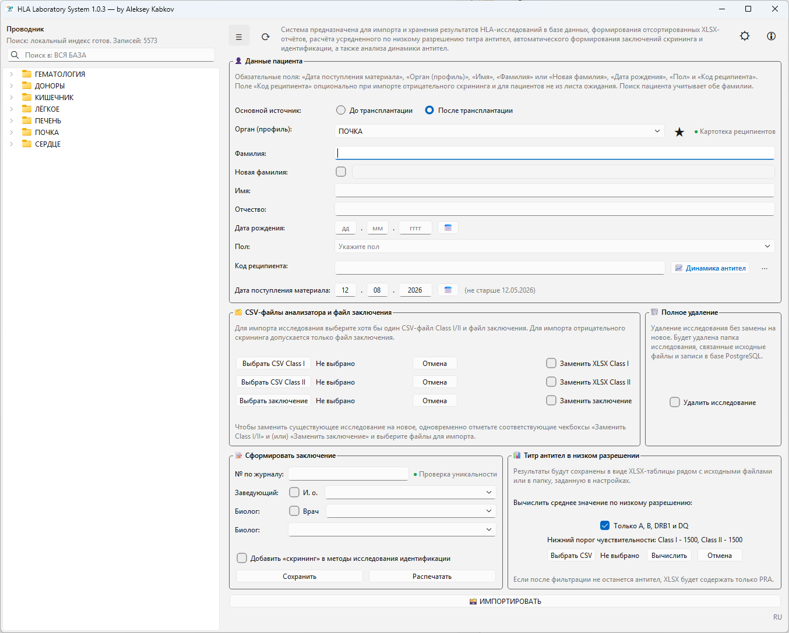
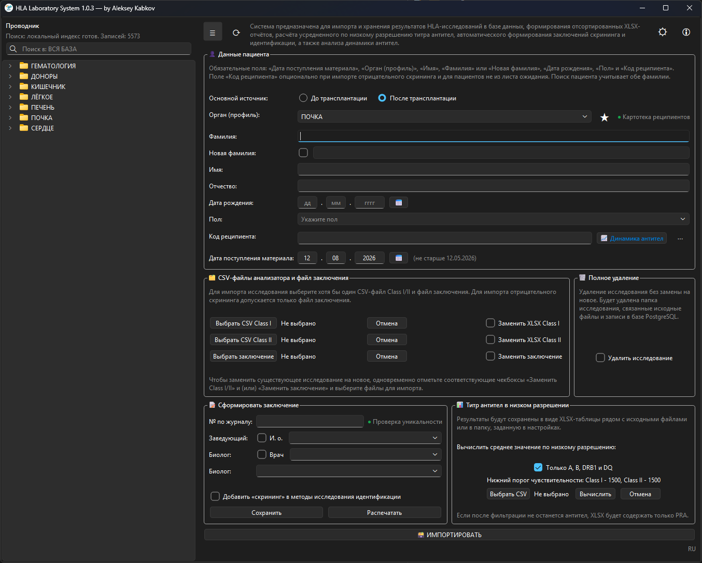
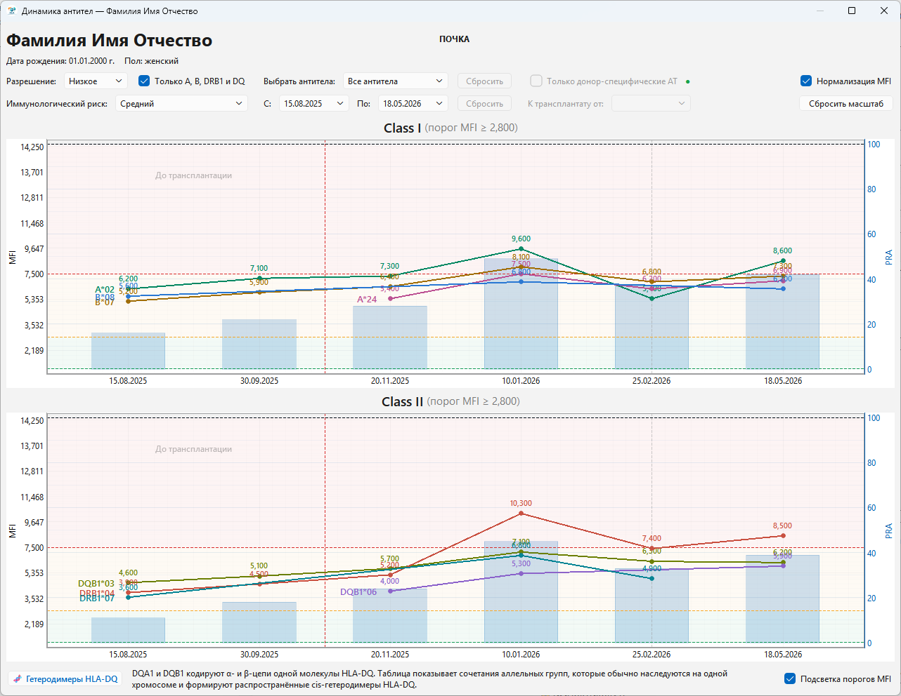
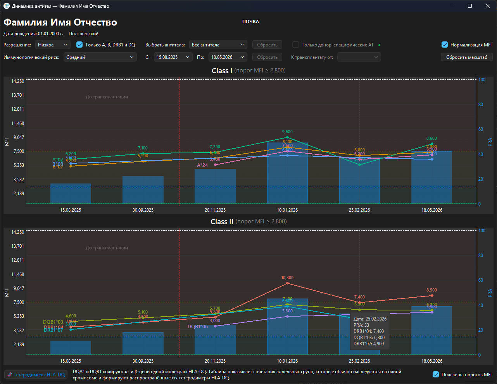

# HLA Laboratory System 1.0.3

**HLA Laboratory System** — программный комплекс для лабораторий иммуногенетики и клинических специалистов в области трансплантологии. Объединяет импорт результатов HLA-анализа, ведение файлового архива пациентов, подготовку документов, поиск исследований и анализ динамики антител с учётом референтных популяционных частот аллелей и донор-специфичности.

Приложение сопровождает весь путь данных исследования: от исходной выгрузки анализатора до записи в базе данных, готовых отчётов и структурированного архива. Структурированные значения показателя панель-реактивных антител (PRA) и интенсивности флуоресценции (MFI) можно использовать для интеграции с системой листа ожидания и последующей виртуальной оценки иммунологической совместимости донора и реципиента — виртуального кросс-матча.

Единый рабочий процесс сокращает повторный ввод, уменьшает вероятность расхождений между файлами и базой данных и упрощает ретроспективный анализ истории исследований пациента.

## Интерфейс

  
  

  
  

## Практическая польза

Для лаборатории:

- единый сценарий импорта результатов для HLA класса I и II вместо ручного переноса данных между файлами, таблицами и папками;
- проверка обязательных данных и допустимого диапазона PRA, а для пары CSV-файлов — совпадения пациента и дат исследования и корректного сочетания классов;
- автоматическое формирование структурированного архива пациентов и XLSX-отчётов;
- подготовка заключений в нескольких форматах;
- подготовка структурированных PRA и MFI для системы листа ожидания, последующего виртуального кросс-матча, клинического и научного анализа;
- согласованная работа нескольких рабочих мест с общей файловой базой;
- контролируемое удаление, замена и восстановление файлов, созданных или импортированных приложением.

Для клинических специалистов:

- быстрый поиск пациентов, исследований и документов;
- единая хронология антител к HLA класса I и II вместе с PRA;
- интерактивные графики с низким и высоким уровнем детализации антител;
- расчёт усреднённого MFI аллельных групп с учётом референтных популяционных частот;
- наглядное сопоставление MFI с пороговыми зонами потенциального иммунологического риска и выбор уровня риска для отображения данных;
- визуальное преобразование графика по фактическому титру антител, вместо интенсивности флуоресценции (MFI);
- фильтрация донор-специфических антител по выбранной дате трансплантации;
- автоматическое выявление изолированного роста MFI отдельной аллельной специфичности внутри группы;
- справочник распространённых цис-кодируемых гетеродимеров HLA-DQ для интерпретации антител при неполном типировании донора.

## Ключевые возможности

### Импорт результатов HLA-анализа

Приложение обрабатывает CSV-выгрузки HLA-анализатора фиксированной структуры с результатами для HLA класса I и II. Во время импорта оно:

- извлекает сведения о пациенте, дате партии, PRA и выявленных антителах;
- проверяет, что выбранные файлы относятся к одному пациенту и исследованию и образуют допустимую пару классов I и II;
- добавляет к исследованию заключение в формате JPEG, DOC или DOCX;
- сохраняет исходные данные в архив пациента;
- формирует XLSX-отчёт с сортировкой результатов по MFI;
- преобразует заключения DOC/DOCX в PDF при наличии Microsoft Word;
- сохраняет структурированные данные исследования в базе данных PostgreSQL.

Отрицательный скрининг можно сохранить в файловом архиве вместе с заключением, не создавая в базе данных запись с результатами антител.

### Архив пациентов и поиск

Файловый архив организован по профилям, пациентам и датам исследований. Приложение находит существующую папку пациента, создаёт новую и при необходимости переименовывает ранее созданные папки по актуальным правилам.

Встроенная боковая панель «Проводник» позволяет:

- перемещаться по пациентам и исследованиям;
- искать файлы и папки по имени;
- быстро находить данные в сетевом архиве с помощью локального индекса;
- искать непосредственно в дереве архива, если локальный индекс временно недоступен;
- выполнять разрешённые операции с пользовательскими файлами, защищая файлы исследования от случайного изменения.

### Документы и отчёты

Приложение формирует и хранит:

- XLSX-отчёты с сортировкой результатов по MFI;
- отдельный XLSX-отчёт раздела «Титр антител в низком разрешении» с взвешенным усреднённым MFI;
- DOCX-заключения;
- сохранение PDF-копий заключений через Microsoft Word;
- JPEG-заключения и сопутствующие документы пациента.

### Клинический анализ динамики антител

Окно «Динамика антител» объединяет историю пациента из основной и, при необходимости, дополнительной базы данных PostgreSQL на общей временной оси. Синхронные графики показывают MFI антител к HLA класса I и II, а PRA выводится на отдельной шкале. Участки истории из разных источников визуально разграничиваются; дополнительная база используется только для чтения.

Пациента можно найти по коду реципиента и профилю органа либо по персональным данным. Пользователь выбирает диапазон дат, степень детализации специфичностей, отображаемые группы антител и пороговые уровни.

Для анализа доступны:

- низкое разрешение с объединением результатов по аллельным группам и высокое разрешение с отображением отдельных аллельных специфичностей;
- расчёт усреднённого MFI аллельной группы с учётом референтных популяционных частот входящих в неё аллелей; та же методика применяется в отдельном XLSX-отчёте, а при недоступности полного справочника приложение предупреждает пользователя и применяет обычное среднее;
- включаемое нелинейное преобразование визуальной шкалы MFI по модели Хилла, которое позволяет одновременно различать средние и высокие значения, сохраняя исходные MFI в подписях;
- пороговые линии и цветовые зоны MFI «Низкий», «Средний», «Высокий» и «Критический»; выбранный уровень определяет порог отображения значений;
- фильтр донор-специфических антител: для выбранного органа и даты трансплантации график сопоставляется с HLA-специфичностями соответствующего донора, не изменяя исходные исследования;
- автоматическое выявление роста MFI отдельной аллельной специфичности не менее чем на 50 % между соседними доступными измерениями этой специфичности при отсутствии роста усреднённого MFI соответствующей аллельной группы; даты и значения выводятся в отдельной таблице;
- фильтр специфичностей по локусам и аллельным группам.

Встроенный справочник распространённых цис-кодируемых гетеродимеров HLA-DQ сопоставляет антитела реципиента к цепи DQA1 со специфичностью DQB1 донора и приводит ориентировочные частотные оценки положительного виртуального кросс-матча, рассчитанные на основе опубликованных данных. Он предназначен для интерпретации антител к HLA-DQ при неполном или низкоразрешающем типировании донора, а не для автоматического расчёта вероятности у конкретного пациента.

Справочник не подтверждает фазировку конкретного донора, не заменяет прямое типирование DQA1 и DQB1 и сам по себе не определяет результат виртуального кросс-матча. Пороговые уровни MFI требуют интерпретации в соответствии с принятой лабораторной практикой. Все средства анализа подготавливают и наглядно представляют данные, но не рассчитывают индивидуальный клинический риск и не заменяют лабораторную верификацию и решение специалиста.

### Дополнительные источники данных

При необходимости приложение может использовать:

- внешнюю картотеку пациентов только для чтения, поиска и автозаполнения;
- локальную копию картотеки для работы при временной недоступности источника;
- дополнительную базу данных PostgreSQL с историческими исследованиями;
- каталог донорских HLA-специфичностей для фильтрации донор-специфических антител.

Основной рабочей базой исследований остаётся база данных PostgreSQL, настроенная для конкретной организации.

### Надёжность и защита данных

Для снижения риска потери или рассогласования данных предусмотрены:

- предварительные проверки перед импортом и изменением исследований;
- блокировка одновременной записи с нескольких рабочих мест;
- снимки состояния и откат незавершённых файловых операций;
- защита файлов исследования от случайного изменения;
- отдельное восстановление созданных приложением CSV, XLSX и PDF;
- ограниченный режим при временной недоступности внешних ресурсов;
- отдельные сборки, предназначенные только для просмотра;
- хранение учётных данных в системном хранилище Windows.

Конкретная сетевая топология, правила доступа и административные процедуры определяются ответственной организацией и не являются частью пользовательского интерфейса.

## Типовой рабочий процесс

1. Лаборант выбирает профиль и вводит или находит данные пациента.
2. Добавляет один или два CSV-файла анализатора и файл заключения.
3. Приложение проверяет, что выбранные файлы относятся к одному исследованию.
4. Пользователь выбирает существующую папку пациента или создаёт новую.
5. Исходные файлы, отчёты и заключение сохраняются в единый архив.
6. Структурированные данные сохраняются в базе данных PostgreSQL.
7. Исследование становится доступно через проводник, поиск и окно динамики антител.

## Форматы и внешние системы

| Назначение               | Форматы и средства                                                                                                  |
| ------------------------ | ------------------------------------------------------------------------------------------------------------------- |
| Исходные результаты      | CSV для HLA класса I и II поддерживаемой структуры                                                                  |
| Заключения               | JPEG, DOC и DOCX; сохранение PDF после преобразования                                                               |
| Отчёты                   | XLSX, DOCX и PDF                                                                                                    |
| Файловый архив           | общий структурированный архив пациентов и исследований                                                              |
| Основные данные          | PostgreSQL                                                                                                          |
| Быстрый поиск            | локальный индекс SQLite                                                                                             |
| Дополнительные источники | картотека пациентов и каталог донорских HLA-специфичностей из листа ожидания, дополнительная база данных PostgreSQL |

## Технологии

- **Python** — основной язык приложения и прикладной логики.
- **PySide6 / Qt 6** — настольный интерфейс, диалоги и фоновые задачи.
- **PostgreSQL, SQLAlchemy и psycopg2** — структурированные данные исследований и согласование совместной работы.
- **SQLite** — локальный индекс файлового архива.
- **pandas и openpyxl** — обработка таблиц и создание XLSX.
- **python-docx** — формирование DOCX-документов.
- **pyqtgraph** — интерактивные графики динамики антител.
- **pywin32 и системные интерфейсы Windows** — взаимодействие с Microsoft Word и средствами безопасности Windows.
- **keyring** — работа с системным хранилищем учётных данных.
- **Nuitka** — подготовка автономной поставки для Windows.

Для подключения дополнительных внешних каталогов могут использоваться ODBC, PostgreSQL, MySQL/MariaDB или драйверы Oracle. Они дополняют, но не заменяют основную базу данных приложения.

## Системные требования

- 64-разрядная Windows 10 версии 1809 или новее либо Windows 11;
- доступ к настроенному файловому архиву и базе данных PostgreSQL для работы со всеми функциями;
- Microsoft Word, если требуется автоматическое преобразование DOC/DOCX в PDF;
- соответствующий драйвер, если подключён внешний каталог пациентов или донорских HLA-специфичностей.

Для запуска собранного приложения отдельная установка Python не требуется.

## Адаптация и развёртывание

Для другой HLA-лаборатории со сходным рабочим процессом Лицензиар может подготовить адаптированную Официальную сборку: изменить профили, обязательные поля пациента, сотрудников, шаблоны документов, поддерживаемые выгрузки анализатора и внешние источники данных. Авторизованный получатель меняет только пользовательские и административные настройки, прямо предусмотренные интерфейсом и поставленной документацией; это не является изменением собственного кода проекта.

Административные инструкции намеренно отделены от публичного описания продукта:

- [эксплуатационные сценарии](Scripts/README.md);
- [подготовка защищённой файловой базы](Scripts/Encryption/README.md);
- [ручное обновление сборок только для просмотра](Scripts/Update/README.md).

Перед рабочим использованием адаптированная конфигурация должна пройти приёмочные испытания на тестовых данных.

## Область применения

- Приложение создано для процессов HLA-лаборатории и прежде всего ориентировано на трансплантологию и наблюдение пациентов после трансплантации.
- Поддерживаются только согласованные форматы выгрузки анализатора.
- Проект не является универсальной лабораторной информационной системой.
- Приложение не является медицинской экспертной системой, не ставит диагноз и не принимает клинические решения вместо специалиста.
- Работа с медицинскими и персональными данными требует соблюдения применимых организационных, правовых и технических мер защиты.

## Публичная редакция, лицензия и контакты

Публичный репозиторий является ознакомительной редакцией проекта, исходный код которой опубликован для просмотра. Публичный доступ, наличие исходного кода или получение копии программы от третьего лица сами по себе не разрешают собирать, устанавливать, запускать, изменять или распространять программу.

Право внутренней эксплуатации Официальной сборки получает только прямо указанный физический или юридический получатель, которому Aleksey Kabkov одновременно непосредственно передал эту сборку и выдал адресное письменное разрешение. Одно адресное разрешение допускает один установленный экземпляр непосредственно переданной Официальной сборки только на одном указанном физическом компьютере, сервере или виртуальной машине. Для одновременной установки на десяти ПК требуются десять самостоятельных адресных разрешений, даже если на всех ПК используется одна и та же версия. Такое разрешение не даёт права изменять собственный код проекта, распространять программу, выдавать сублицензии или удалять сведения об авторе, разработчике и правообладателе. Полные нормативные условия и исключения для сторонних компонентов установлены только в [LICENSE.txt](LICENSE.txt).

По вопросам получения Официальной сборки и адресного разрешения на её использование:

- электронная почта: `aleksey.kabkov@gmail.com`;
- LinkedIn: <https://www.linkedin.com/in/aleksey-kabkov-981b59292/>.

Сведения об авторстве и сторонних компонентах:

- [COPYRIGHT.txt](COPYRIGHT.txt);
- [AUTHORS.md](AUTHORS.md);
- [THIRD_PARTY_LICENSES.txt](THIRD_PARTY_LICENSES.txt);
- [licenses/](licenses).

Copyright © 2026 Aleksey Kabkov. Все права защищены.
